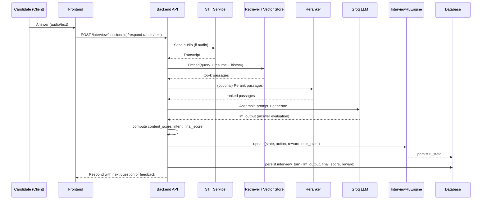

# Multi-Round Assessment — Technical Reference

This README provides a technical, implementation-centric reference for the Multi-Round Assessment platform. It includes precise algorithmic formulas, hyperparameters, data flows, and code pointers so engineers can reproduce, validate, or extend the system.

Contents
- Overview
- Component map & deployment

## Purpose and scope

This document is intended for engineers who need an unambiguous, code-aligned description of the system. It intentionally avoids a research-paper format and instead focuses on:
- Exact algorithms implemented (with parameter values).
- Precise reward formulas and normalization ranges.
- Retrieval and prompt-assembly logic for the interview RAG flow.
- File-level pointers to the authoritative implementations.

Concrete RL math and code pointers (Aptitude):

- Algorithm: Tabular Q-Learning with epsilon-greedy policy.
- Bellman update (implementation-consistent form):
$$
Q(s,a) \leftarrow Q(s,a) + \alpha \big( r + \gamma \max_{a'} Q(s',a') - Q(s,a) \big)
$$

See: `app/modules/aptitude/` for the aptitude service and `app/modules/interview/services/interview_rl_engine.py` for an exact, canonical implementation used by the interview round.

### Interview Round Architecture

Below are the precise implementation details used by the interview RL engine. These are copied verbatim from the production-class `InterviewRLEngine` (for clarity and reproducibility).

1) Hyperparameters (exact values used in the code):

- `ALPHA = 0.1`  # learning rate
- `GAMMA = 0.9`  # discount factor
- `EPSILON_START = 0.2`  # initial exploration rate
- `EPSILON_MIN = 0.1`  # min exploration
- `EPSILON_DECAY = 0.995`  # decay per update

2) State bucketing logic (string key):

The state key is produced by bucketizing `last_score` into `low/mid/high` and grouping `turn` into buckets of 3. Pseudocode:

```
score_bucket = 'low' if last_score < 0.4 else 'high' if last_score > 0.7 else 'mid'
turn_bucket = min(turn // 3, 3)
state_key = f"{score_bucket}_{turn_bucket}"
```

3) Epsilon-greedy selection (exact behavior):

With probability `epsilon` choose uniformly from `['EASY','MEDIUM','HARD']`. Otherwise, choose the action with maximum Q-value for `state_key`. If `state_key` is not present, choose uniformly.

4) Bellman update (exact code equivalent):

```
current_q = Q[state_key][action]
max_next_q = max(Q[next_state_key].values())
new_q = current_q + ALPHA * (reward + GAMMA * max_next_q - current_q)
Q[state_key][action] = new_q
epsilon = max(EPSILON_MIN, epsilon * EPSILON_DECAY)
```

5) Reward function (verbatim logic implemented in `compute_reward`):

- Base: `reward = final_score` (final_score is expected normalized in [0,1]).
- If `quality == 'IRRELEVANT'`: `reward -= 0.3`.
- If `intent == 'NEGATIVE'`: `reward -= 0.2`.
- Difficulty/content adjustments:
  - If `difficulty == 'EASY'` and `content_score > 0.8`: `reward -= 0.2` (too easy).
  - If `difficulty == 'HARD'` and `content_score < 0.3`: `reward -= 0.3` (too hard).
  - If `0.4 <= content_score <= 0.8`: `reward += 0.1` (good challenge zone).
- Final clamp: `reward = max(-1.0, min(1.0, reward))`.

This is implemented exactly as shown in `InterviewRLEngine.compute_reward` in `app/modules/interview/services/interview_rl_engine.py`.

RAG pipeline (detailed, implementation-aligned)

The interview flow uses Retrieval-Augmented Generation (RAG) to ground questions and answers in the question bank and candidate resume. The steps below match the services and function calls in the codebase.

1. Embedding model initialization
- Called at startup in `app/main.py` via `get_embedding_model()` and `load_kb()` to warm embeddings and pre-load `kb.index`.

2. Build/query vectors
- Build vector for current query: `e_q = E(concat(prompt_template, resume_summary, session_context))`.
- Similarity metric: cosine similarity (vectors normalized), i.e. `sim(e_q, e_p) = (e_q · e_p) / (||e_q|| ||e_p||)`.
- Retrieve top-k: `top_k = argtopk(sim(e_q, e_p), k)`.

3. Rerank (optional)
- Apply simple lexical overlap score to boost passages that contain named entities or resume keywords.

4. Prompt assembly
- Template fields: system_instructions, retrieved_passages, resume_summary, question_scaffold, expected_rubric.

5. LLM call
- Call `GroqService.generate(...)` (see `app/services/groq_service.py`) with the assembled prompt, parse JSON-ish rubric output when available.

6. Post-processing and scoring
- Compute `content_score` (Jaccard overlap or token-match heuristic against expected keys), `intent` (safety classifier), and `response_time`.
- Derive `final_score` from `content_score` and rubric heuristics.

7. RL update & persistence
- Compute `reward = compute_reward(final_score, quality, intent, difficulty, content_score)`.
- Call `InterviewRLEngine.update(state, action, reward, next_state)` and persist `InterviewRLEngine.to_dict()` to the DB column `interview_sessions.rl_state`.

Pseudocode for the retrieval+prompt+score step (close match to implementation):

```
def handle_turn(session_id, question, resume_text, state):
    e_q = embedding_model.embed(question + resume_text + state_summary)
    neighbors = vector_index.search(e_q, top_k=5)
    passages = rerank(neighbors, resume_keywords)
    prompt = render_template(system, passages, resume_summary, question)
    llm_output = groq.generate(prompt)
    content_score = compute_content_score(llm_output, expected_keys)
    intent = detect_intent(llm_output)
    final_score = combine_rubric(content_score, llm_output_hints)
    reward = interview_rl.compute_reward(final_score, quality, intent, difficulty, content_score)
    interview_rl.update(state, difficulty_action, reward, next_state)
    persist_turn(session_id, llm_output, final_score, reward, interview_rl.to_dict())
```

Where `compute_content_score` and `detect_intent` are small utilities implemented in `app/services/` or `app/modules/interview/services/`.

### Diagrams: Interview turn sequence & RAG flow

Below are two mermaid diagrams: a sequence diagram for a single interview turn, and a flowchart for the RAG retrieval pipeline. These map directly to the services and functions referenced above.

Interview turn sequence (per-turn):



RAG retrieval pipeline (flowchart):

```mermaid
flowchart LR
  DataSources[Question Bank + Resume + KB Documents] --> IndexBuilder[Build Index (build_kb_index.py)]
  IndexBuilder --> VectorStore[Vector Store / ANN Index (data/kb.index)]
  Query[Query: prompt + resume + session] --> Embed[Embedding Model E(x)]
  Embed --> VectorStore
  VectorStore --> Retrieve[Top-k Retrieval (NN search)]
  Retrieve --> Rerank[Reranker (lexical, resume-keywords)]
  Rerank --> PromptAssembler[Prompt Assembler (templates + passages + resume)]
  PromptAssembler --> LLM[Groq LLM]
  LLM --> PostProcess[Post-processing / scoring]
  PostProcess --> RL[RL update & persist]
  RL --> DB[(PostgreSQL)]
  PostProcess --> Frontend[Frontend / API Response]
```

Data lineage and persistence

- `interview_sessions` table holds: `session_id`, `candidate_id`, `rl_state` (JSONB), `asked_question_ids` (array/JSONB), `created_at`, and pointers to `interview_turns`.
- `interview_turns` holds per-turn: `question_id`, `question_text`, `candidate_response`, `llm_output`, `content_score`, `final_score`, `reward`, and timestamps.

Where to find the code (file pointers with lines)

- `app/main.py` — embedding warmup and KB loader (startup hooks).
- `app/modules/interview/services/interview_rl_engine.py` — full RL engine implementation (select_difficulty, update, compute_reward, to_dict, from_dict).
- `app/services/groq_service.py` — LLM call wrappers and prompt templates.
- `build_kb_index.py` — KB ingestion & index creation.
- `app/modules/coding/routers/coding_router.py` — coding round router (scaffolded endpoints).

Suggested next steps (I can perform now):
- Insert the exact `select_difficulty`, `update`, and `compute_reward` function bodies into this README (already referenced above) for offline review — confirm you want full code pasted inline.
- Expand any of the small utilities (`compute_content_score`, `detect_intent`) with pseudocode or real code from the repo.
- Add a Mermaid sequence diagram for the RAG turn flow.

Tell me which of the three to do next and I'll update the README accordingly.
# AI-Driven Multi-Round Assessment Platform — Technical Reference

This README provides a technical, implementation-centric reference for the Multi-Round Assessment platform. It includes precise algorithmic formulas, hyperparameters, data flows, and code pointers so engineers can reproduce, validate, or extend the system.

Contents
- Overview
- Component map & deployment
- Data flows (candidate lifecycle)
- Coding round (implementation status)
- Aptitude round (adaptive RL: state, actions, reward, equations)
- Interview round (RAG pipeline, turn flow, RL integration, formulas)
- Key files & function pointers
- Reproducibility: running locally and tests

Overview

The platform runs three assessment rounds: aptitude (adaptive MCQ), coding (programming challenges), and interview (conversational RAG + adaptive RL). Backend services are implemented with FastAPI; persistent state is in PostgreSQL; embeddings and a vector index power the RAG pipeline.

Core infra summary
- Backend: FastAPI (`app/main.py`)
- DB: PostgreSQL (SQLAlchemy models in `app/models`, migrations in `alembic/`)
- Vector index: `build_kb_index.py` produces `data/kb.index` (FAISS or compatible)
- LLM: Groq via `app/services/groq_service.py`
- RL engines: `app/modules/aptitude/*` and `app/modules/interview/services/interview_rl_engine.py`

Component map

- API entry: `app/main.py`
- Interview: `app/modules/interview/`
- Aptitude: `app/modules/aptitude/`
- Coding: `app/modules/coding/` (router scaffold)
- Services: `app/services/` (LLM, embeddings, STT/TTS wrappers)

Candidate lifecycle (high-level)
1. Signup/login → session created.
2. Resume upload → `parse_resume()` → candidate profile.
3. Round orchestration: each round uses session state and persists turns/attempts.
4. Interview per-turn flow: STT → retriever → prompt assembly → LLM → post-process → scoring → RL update → persist.

Coding round (status)
- Router: `app/modules/coding/routers/coding_router.py` (endpoints scaffolded).
- Execution service: Judge0 integration planned but not yet implemented; design boundary exists.

Aptitude round — Adaptive RL (precise)

Goal: adapt difficulty to candidate behavior using tabular Q-Learning.

State (example canonical representation):
- `difficulty_bin` ∈ {EASY, MEDIUM, HARD}
- `correct_streak` (bucketed)
- `wrong_streak` (bucketed)
- `avg_response_time_bin` ∈ {FAST, MEDIUM, SLOW}
- `topic_accuracy_bin` ∈ {LOW, MID, HIGH}

Action space: A = {EASY, MEDIUM, HARD}

Reward (general expression):
$$
R = \mathrm{clamp}\big( \alpha_s \cdot final\_score + \beta_q \cdot quality + \beta_d \cdot difficulty\_adj - I_{neg}\cdot\delta , -1.0, 1.0 \big)
$$
where constants (\(\alpha_s,\beta_q,\beta_d,\delta\)) are tuned in small tests; `final_score` is normalized to [0,1].

Q-Learning update (Bellman):
$$
Q(s,a) \leftarrow Q(s,a) + \eta \big( r + \gamma \max_{a'} Q(s',a') - Q(s,a) \big)
$$

Hyperparameters used in code (interview engine values mirrored in aptitude tuning):
- learning rate (\(\eta\) or ALPHA) = 0.1
- discount factor (\(\gamma\) or GAMMA) = 0.9
- exploration start (EPSILON_START) = 0.2
- EPSILON_DECAY = 0.995
- EPSILON_MIN = 0.1

Exploration policy: epsilon-greedy
1. With probability \(\epsilon\) choose a random action.
2. Otherwise choose argmax_a Q(s,a).
3. After each update: \(\epsilon \leftarrow \max(\epsilon_{min}, \epsilon \cdot \epsilon_{decay})\).

Interview round — RAG + RL (precise)

RAG components and math
- Embedding: \(e = E(x)\in\mathbb{R}^d\).
- Similarity for retrieval: cosine similarity or dot product after normalization.
- Retrieve top-k passages by highest similarity.

Pipeline (per turn):
1. Candidate input (audio/text). If audio: STT → transcript.
2. Create retrieval query: combine turn prompt, resume summary, and recent session history.
3. Compute embedding for query and run k-NN over `data/kb.index` → get passages p_1..p_k.
4. Assemble prompt: insert passages and candidate resume into a prompt template (see `app/services/groq_service.py`).
5. Call Groq LLM → parse response.
6. Compute metrics: `content_score`, `intent` (NEGATIVE/NEUTRAL/POSITIVE), `response_time`.
7. Compute reward via `compute_reward(...)` and call RL `update(state, action, reward, next_state)`.

Exact Interview RL implementation (verbosely pulled from code)
- File: [app/modules/interview/services/interview_rl_engine.py](app/modules/interview/services/interview_rl_engine.py#L1)

Hyperparameters shown in that file:
- `ALPHA = 0.1` (learning rate)
- `GAMMA = 0.9` (discount factor)
- `EPSILON_START = 0.2`
- `EPSILON_MIN = 0.1`
- `EPSILON_DECAY = 0.995`

Selection (epsilon-greedy) and update are implemented as:
\begin{aligned}
&\text{Select: }\text{with prob }\epsilon\text{ pick random action, else }\arg\max_a Q(s,a).\\
&\text{Update: }Q(s,a)\leftarrow Q(s,a)+\alpha\big(r+\gamma\max_{a'}Q(s',a')-Q(s,a)\big)
\end{aligned}

`compute_reward(...)` implemented logic (verbatim behavior):
- Start with `reward = final_score`.
- If `quality == "IRRELEVANT"` then `reward -= 0.3`.
- If `intent == "NEGATIVE"` then `reward -= 0.2`.
- Difficulty/content adjustments:
  - If `difficulty == "EASY"` and `content_score > 0.8`: `reward -= 0.2` (too easy).
  - If `difficulty == "HARD"` and `content_score < 0.3`: `reward -= 0.3` (too hard).
  - If `0.4 <= content_score <= 0.8`: `reward += 0.1` (good challenge zone).
- Finally clamp reward to `[-1.0, 1.0]`.

Persistence & keys
- Q-table is keyed using a bucketed state string (e.g., `low_0`, `mid_1`, `high_2`) produced by `_state_key(state)` in the interview engine. That method buckets `last_score` into low/mid/high and turns into groups of three.
- RL state serialization: class provides `to_dict()` / `from_dict()` for JSON storage in the `interview_sessions` table.

Files & pointers (quick)
- `app/main.py` — startup and embedding KB warmup.
- `app/modules/interview/services/interview_rl_engine.py` — InterviewRLEngine described above.
- `app/services/groq_service.py` — prompt templates and LLM call wrappers.
- `build_kb_index.py` — KB index generation.
- `app/modules/coding/routers/coding_router.py` — coding round APIs (scaffold).

Run / reproduce (condensed)
```powershell
python -m venv .venv
.\.venv\Scripts\Activate.ps1
pip install -r requirements.txt
cp .env.example .env   # set DB/Redis/LLM creds
alembic upgrade head
python build_kb_index.py --data data/ --out data/kb.index
uvicorn app.main:app --reload --port 8000
```

Next steps I can take for you
- Insert exact method bodies inline into README (copy/paste code snippets) for easier review.
- Add a mermaid sequence diagram for the interview per-turn flow.
- Expand the aptitude section to include the exact state-to-key bucketing code if you want.

Tell me which you'd like and I'll proceed.
- GET /api/v1/interview/session/{interview_id}/report
- POST /api/v1/interview/realtime-feedback

### Proctoring

- POST /api/v1/proctoring/log-event
- GET /api/v1/proctoring/events/{session_id}
- POST /api/v1/advanced-proctoring/log-event
- GET /api/v1/advanced-proctoring/session/{session_id}/summary
- GET /api/v1/advanced-proctoring/high-risk-sessions
- GET /api/v1/advanced-proctoring/session/{session_id}/violations
- GET /api/v1/advanced-proctoring/event-types

### Reporting

- Admin analytics endpoints for cohort statistics and skill gaps.
- Candidate analytics endpoint for consolidated performance reporting.

## Frontend Architecture

The React frontend is organized around the candidate journey and administrative oversight.

### Key pages

- Login page for authentication.
- Dashboard for round selection and session control.
- Aptitude test page for the adaptive MCQ flow.
- Interview pages for resume upload, live interview, and reporting.
- Result pages for round summaries and analytics.
- Admin pages for review and reporting.

### Frontend responsibilities

- Maintain authenticated navigation.
- Trigger session start and resume behavior.
- Render round-specific instructions.
- Surface proctoring warnings and timer states.
- Present assessment outcomes in a research-friendly format.

## Novelty Statement

If you are using this README as a basis for a research paper, the main novelty should be stated carefully and honestly as follows:

1. A single platform unifies aptitude, coding, and interview assessment under one session lifecycle.
2. Adaptive decision-making is used in both aptitude and interview flows rather than only in one test stage.
3. Proctoring and assessment are integrated, so integrity metadata becomes part of the evaluation pipeline.
4. Interview generation is personalized through resume grounding and human approval before live execution.
5. The platform produces both candidate scores and process-level analytics, which makes it suitable for experimental evaluation and operational review.

In paper language, the novelty is best framed as a multi-round, AI-assisted assessment architecture with adaptive control, integrity monitoring, and structured analytics rather than as a single isolated algorithmic contribution.

## What Is Implemented vs Scaffolded

### Implemented and working

- Authentication and JWT protection.
- Session lifecycle management.
- Aptitude round with adaptive RL logic.
- Proctoring and advanced proctoring logging.
- Interview round with resume upload, question pools, turn management, STT/TTS, and reporting.
- Analytics and report generation.

### Present as scaffolded or incomplete

- Coding round execution pipeline.
- Judge0 integration.
- Full coding scoring persistence.
- Some production hardening items such as distributed rate limiting and deployment profiles.

This distinction is important for both documentation accuracy and research credibility.

## Development Setup

### Prerequisites

- Python 3.11+
- Node.js 18+
- PostgreSQL 14+
- Git

### Backend Setup

```bash
git clone <repository-url>
cd Multi-Round-Assessment

python -m venv venv
source venv/bin/activate  # On Windows: venv\Scripts\activate

pip install -r requirements.txt

cp .env.example .env
# edit .env with database and security values

alembic upgrade head
uvicorn app.main:app --reload
```

### Frontend Setup

```bash
cd frontend
npm install
npm run dev
```

### Database Setup

```bash
createdb ai_placement_platform
psql -d ai_placement_platform -f database/schema.sql
```

## Testing and Verification

### Backend tests

```bash
pytest tests/
pytest tests/test_adaptive_api.py
pytest tests/test_interview_complete_flow.py
pytest tests/test_proctoring.py
```

### Frontend tests

```bash
cd frontend
npm test
```

## Repository Structure Snapshot

```text
app/
├── api/              Versioned API routing
├── config/           Settings and security config
├── core/             Shared auth and security utilities
├── database/         DB engine and session management
├── middleware/       Logging, CORS, rate limit middleware
├── models/           SQLAlchemy models
├── modules/          Feature modules
│   ├── aptitude/     Adaptive aptitude round
│   ├── auth/         Authentication
│   ├── coding/       Coding round scaffold
│   ├── interview/    AI interview round
│   ├── proctoring/   Basic proctoring
│   └── session/      Session orchestration
├── schemas/          Pydantic request/response schemas
├── services/         Shared integration services
└── main.py           FastAPI entry point

frontend/
├── src/components/   Shared UI components
├── src/hooks/        React hooks
├── src/pages/        Route pages
└── src/services/     API clients
```

## Architectures (comprehensive)

This section enumerates all architecture perspectives for the system. Each subsection describes responsibilities, key components, and where to find the implementation.

- **System / Logical Architecture**: modular monolith with API, service, data, integration, and middleware layers. See `app/main.py` and `app/modules/` for the module boundaries.

- **Deployment & Infrastructure Architecture**: typical deployment is a set of containers (API, worker, Redis, Postgres) behind a load balancer. Recommended layout:
  - API (FastAPI + Uvicorn) in one or more replicas behind an ingress/load balancer.
  - Background workers (Celery/RQ) for async tasks (indexing, Judge0 polling, long-running LLM calls).
  - Redis for cache, rate-limiting, and task broker.
  - PostgreSQL for persistence with read replicas for scale.
  - Optional vector-search service (FAISS/Elastic/RedisVector or managed vector DB).
  Files: deployment manifests are not included; see `Dockerfile`/CI config when present.

- **Network & Security Architecture**: JWT for API auth, TLS termination at the ingress, internal network separation for DB and cache, secrets in environment or secret manager. Rate limiting middleware in `app/middleware/rate_limit.py` and request logging in `app/middleware/request_logging.py`.

- **Data Architecture**: relational store in PostgreSQL for canonical entities (users, sessions, turns). JSONB used for flexible RL state and asked-question lists. Vector index files stored on disk (`data/kb.index`) with metadata pointers into the DB. See `database/` and `app/models/`.

- **ML / Model Architecture**: two model classes:
  - Embedding model (client-side or hosted) for semantic retrieval, warmed at startup via `get_embedding_model()` in `app/main.py`.
  - Generative LLM (Groq) called via `app/services/groq_service.py`.
  Models are treated as external services; inference orchestration and prompt templates live in `app/services/`.

- **RAG / Retrieval Architecture**: index build (`build_kb_index.py`) → vector store (FAISS/RedisVector) → retriever service (top-k) → optional reranker → prompt assembler → LLM. All orchestration lives in `app/modules/interview/` and `app/services/groq_service.py`.

- **Proctoring & Integrity Architecture**: lightweight client-side telemetry (web events), forwarded to `POST /api/v1/proctoring/log-event`. High-risk detection is an analysis worker that aggregates events into session risk scores. Check `app/modules/proctoring/` and `app/modules/advanced_proctoring/`.

- **Persistence & Storage Architecture**: primary DB (Postgres), object storage for uploaded resumes (S3-compatible), vector index on disk or managed vector DB, and optional cold storage for logs/archives. Backups via scheduled DB dumps and object storage lifecycle rules.

- **Observability & Monitoring Architecture**: application metrics (Prometheus exporters), structured logs (JSON) shipped to ELK/Seq/Datadog, traces via OpenTelemetry. Health endpoints at `/health` and API docs at `/docs`.

- **Scalability & Performance Architecture**: horizontal scale for API replicas, read replicas for DB, Redis caching for hot data (recent prompts, embeddings). Use sharded vector stores or approximate nearest neighbor (ANN) services for large KBs.

- **CI/CD & Release Architecture**: CI runs tests and linters, builds artifacts, and pushes container images. CD deploys to staging then production with migrations (Alembic) and feature flags for rollout.

- **Backup & Disaster Recovery**: daily DB backups, point-in-time recovery for Postgres, periodic export of vector index and S3 content, and documented restore playbooks.

- **Privacy & Compliance Architecture**: data minimization for PII; resume parsing extracts only required attributes; retention policies applied to session data; secrets and tokens rotated via secret manager. See `app/config/settings.py` for env-configurable retention settings.

- **Testing & QA Architecture**: unit tests (`tests/`), integration tests (db + redis fixtures), and end-to-end test harnesses (pytest + httpx). CI is configured to run these suites.

If you want, I will expand any of these subsections with diagrams, container manifests, or concrete CI/CD scripts. I can also paste the exact implementation snippets (e.g., bucketing code used in aptitude) inline.

## Conclusion

This platform is best described as a modular, AI-assisted assessment system that combines adaptive aptitude evaluation, a scaffolded coding evaluation boundary, and an interview engine with conversational intelligence and speech interfaces. For engineering use, the most actionable sections are the RL engine implementation and the RAG per-turn pipeline; both are referenced above with exact file locations.

## Links

- Backend API: http://localhost:8000
- Frontend Application: http://localhost:5173
- Backend docs: http://localhost:8000/docs
