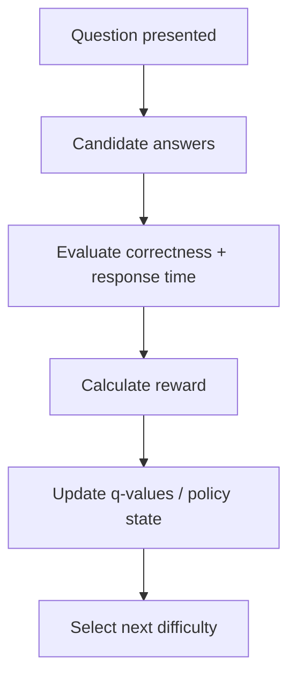
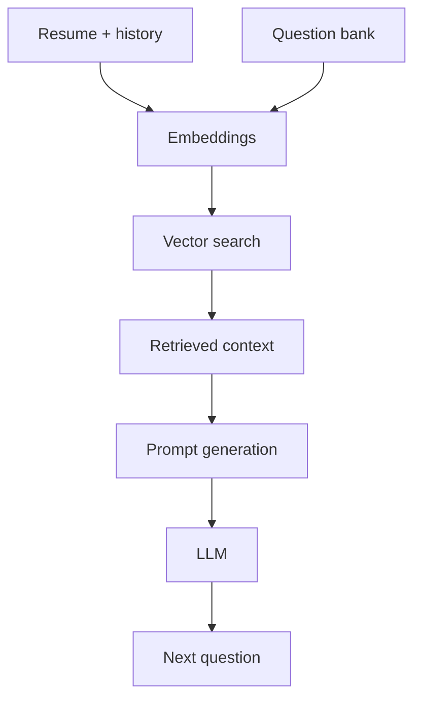

# AI Logic

This document isolates the AI-specific behavior from the general system architecture.

## Aptitude RL

### State

- Current difficulty
- Accuracy so far
- Average response time
- Step number
- Reward history

### Action

- Choose next question difficulty: `easy`, `medium`, or `hard`

### Reward

- Correct answer produces positive reward.
- Incorrect answer produces negative or lower reward.
- Fast correct answers can receive higher reward.
- Slow or repeated incorrect answers reduce reward.

### Update Flow

## Interview RAG

The interview round should use retrieval-augmented generation for question generation and evaluation.

### Inputs

- Resume
- Previous responses
- Question bank
- Role context
- Interview policy constraints

### Pipeline

## Evaluation Dimensions

- `technical_score`
- `communication_score`
- `problem_solving_score`
- Optional `confidence_score`
- Optional `behavioral_score`

## Guidance Rules

- Keep prompt templates bounded by the current round state.
- Use retrieved context, not raw resume text alone.
- Evaluation should be deterministic enough for analytics, even if generation is probabilistic.
- Do not mix interview scoring logic into general session state management.
