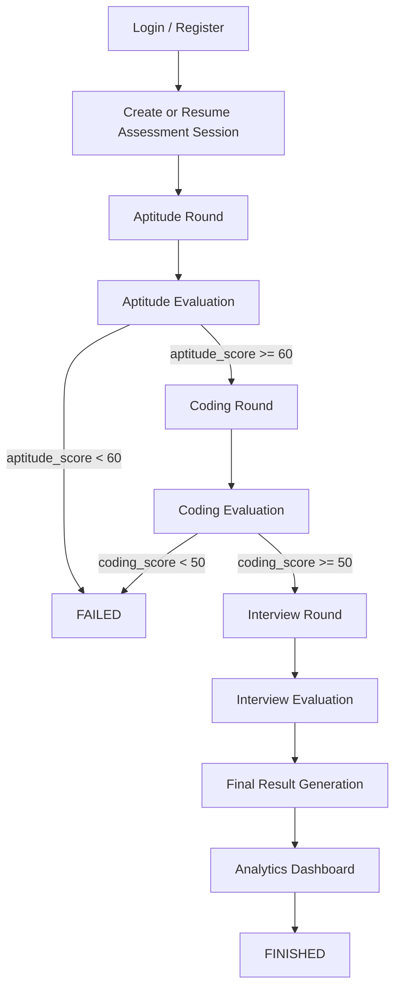
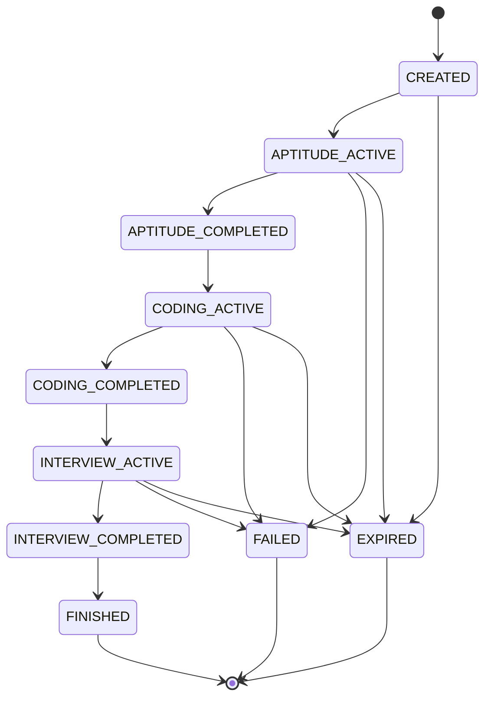

# Master System Flow

This file is the top-level reference for how the assessment platform connects all rounds. It is written to prevent agents from treating the coding round as a standalone app.

## Global Assessment Flow

## Session State Machine

## Round Progression Rules

- Candidate cannot skip rounds.
- Candidate cannot return to a previous round once the round is completed and unlocked the next stage.
- Each round must be completed before the next round becomes available.
- Timer expiry can terminate the current round and move the session to `EXPIRED` or `FAILED` depending on product policy.
- Final report generation only happens after all required rounds are completed.

## Shared Components

- `auth system`: registration, login, JWT issuance, current-user resolution.
- `session manager`: creates the assessment session, initializes rounds, tracks state transitions.
- `timer manager`: maintains `started_at`, `end_time`, and timeout validation for round-specific flows.
- `analytics`: aggregates round scores, attempt metrics, and final result summaries.
- `proctoring`: records browser and environment violations across all rounds.
- `reporting`: creates the final result payload and dashboard-facing summaries.
- `database connection`: SQLAlchemy session factory and migrations.
- `JWT handling`: token creation, decoding, and authorization guards.

## Current Implementation Notes

- The backend currently implements auth, session management, aptitude router stub, and a complete coding round pipeline.
- Interview and proctoring are represented in schema and documentation as system-level contracts, but their full module implementations are not present yet.
- The session model already contains three rounds per session: aptitude, coding, and interview.
