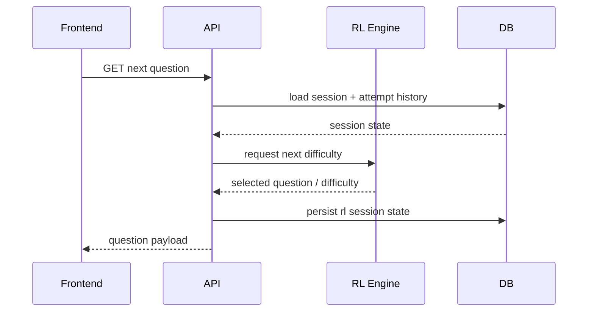
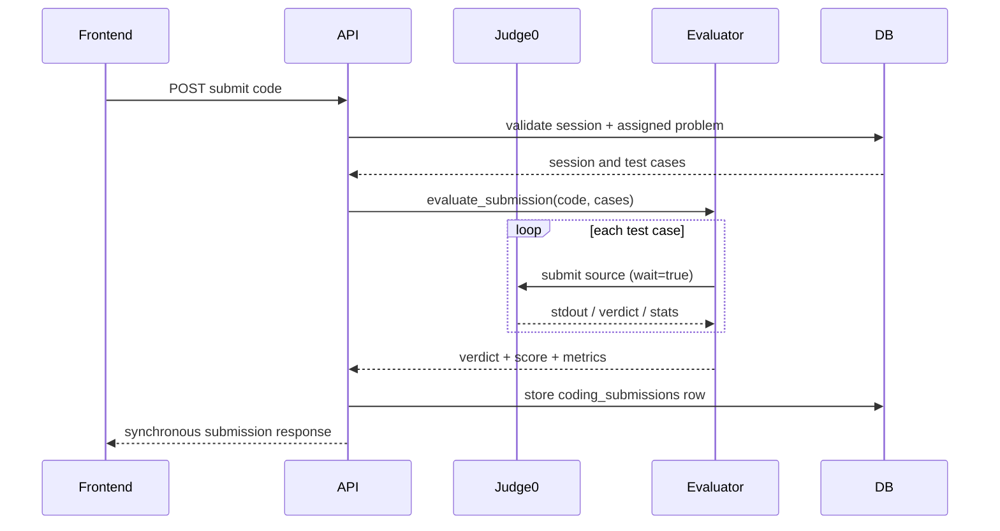
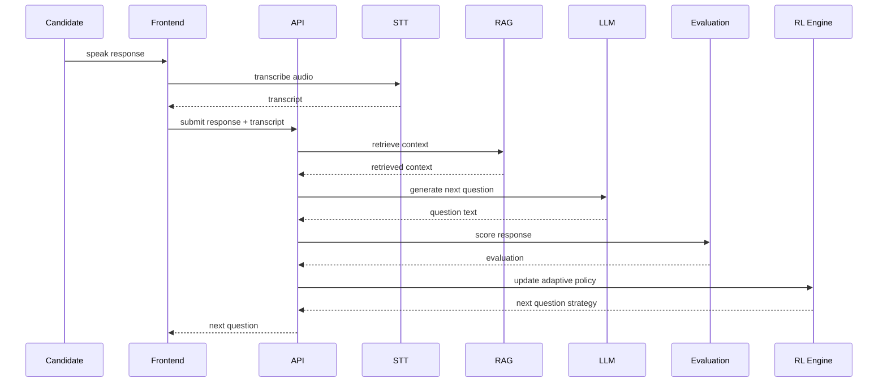
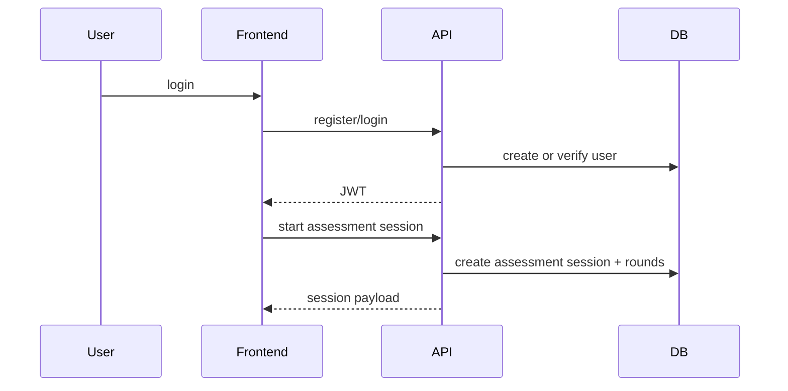

# Sequence Diagrams

These diagrams are intentionally detailed because agents use them to understand the actual control flow.

## Aptitude Flow

## Coding Submit Flow

## Interview Flow

## Session Lifecycle

