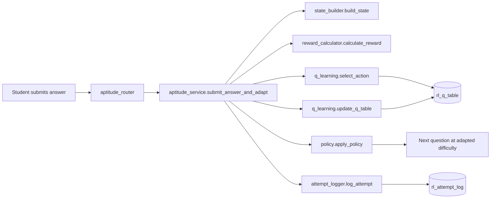

# RL Engine — Implementation Walkthrough

## What Was Built

A complete Q-Learning engine for adaptive aptitude question difficulty, integrated into the FastAPI backend.

## Architecture

## Files Created/Modified

| File | Purpose |
|---|---|
| [rl.py](file:///d:/Projects/EDI%204/Multi-Round-Assesment/app/models/rl.py) | ORM models for `rl_q_table` and `rl_attempt_log` |
| [state_builder.py](file:///d:/Projects/EDI%204/Multi-Round-Assesment/app/modules/aptitude/rl_engine/state_builder.py) | 5-tuple state: difficulty, streaks, response time bin, topic accuracy |
| [reward_calculator.py](file:///d:/Projects/EDI%204/Multi-Round-Assesment/app/modules/aptitude/rl_engine/reward_calculator.py) | Difficulty-weighted reward with time bonus and streak modifier |
| [policy.py](file:///d:/Projects/EDI%204/Multi-Round-Assesment/app/modules/aptitude/rl_engine/policy.py) | Guard rails: no easy→hard jumps, forced decrease on 4+ wrong streak |
| [q_table_store.py](file:///d:/Projects/EDI%204/Multi-Round-Assesment/app/modules/aptitude/rl_engine/q_table_store.py) | PostgreSQL Q-table with [Action](file:///d:/Projects/EDI%204/Multi-Round-Assesment/app/modules/aptitude/rl_engine/q_table_store.py#17-22) enum and optimistic 0.1 defaults |
| [q_learning.py](file:///d:/Projects/EDI%204/Multi-Round-Assesment/app/modules/aptitude/rl_engine/q_learning.py) | Epsilon-greedy selection + Bellman Q-update |
| [attempt_logger.py](file:///d:/Projects/EDI%204/Multi-Round-Assesment/app/modules/aptitude/rl_engine/attempt_logger.py) | Non-blocking audit log for debugging / DQN replay |
| [aptitude_service.py](file:///d:/Projects/EDI%204/Multi-Round-Assesment/app/modules/aptitude/services/aptitude_service.py) | New [submit_answer_and_adapt()](file:///d:/Projects/EDI%204/Multi-Round-Assesment/app/modules/aptitude/services/aptitude_service.py#144-268) with full RL flow |
| [aptitude_schema.py](file:///d:/Projects/EDI%204/Multi-Round-Assesment/app/modules/aptitude/schemas/aptitude_schema.py) | Added [reward](file:///d:/Projects/EDI%204/Multi-Round-Assesment/app/modules/aptitude/rl_engine/reward_calculator.py#27-72), [next_difficulty](file:///d:/Projects/EDI%204/Multi-Round-Assesment/app/modules/aptitude/rl_engine/policy.py#27-44), [next_question](file:///d:/Projects/EDI%204/Multi-Round-Assesment/app/modules/aptitude/routers/aptitude_router.py#53-75) to response |
| [aptitude_router.py](file:///d:/Projects/EDI%204/Multi-Round-Assesment/app/modules/aptitude/routers/aptitude_router.py) | Passes user/session context to RL-driven service |

## Verification Results

| Test | Status | Output |
|---|---|---|
| Syntax check (6 files) | ✅ | All compile cleanly |
| Import check | ✅ | All exports resolve |
| Reward calculator | ✅ | `reward = 2.3` (hard correct + fast + streak) |
| Policy guard rails | ✅ | wrong≥4 → decrease; easy→hard blocked |
| State builder | ✅ | `"medium\|2\|0\|fast\|high"` |
| Full app startup | ✅ | All routes registered |
